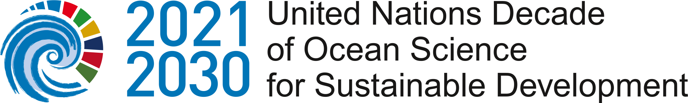

# [Our History](https://www.vliz.be/en/marine-data)

    
  
        The development of the data systems was characterised by a few important milestones. In 2000, the Integrated Marine Information System (IMIS) was initiated. IMIS links persons to institutes, publications, projects, data sets and maps. In 2005, the Open Marine Archive (OMA) was introduced to make the literature collection digitally accessible. Many marine scientists and researchers utilise this system intensively (1,795 requests were replied to in 2023, in 95% of the cases within one day). Another major step was the participation of VLIZ in EU-subsidised programmes. The MarBEF project resulted in the start-up of an EU register for marine species (which would eventually be known as the World Register of Marine Species or WoRMS) and of the VLIMAR Gazetteer (later on known as 'Marine Regions'). Other databases were soon to follow as part of several European projects. 

 

<h1> Marine data </h1>
The arrival of some prominent international players in the VLIZ buildings testifies in the marine data landscape. In 2005, the International Oceanographic Data and Information Exchange (IODE) project office of UNESCO-IOC moved into the VLIZ buildings. This was also the case for the Ocean Teacher Global Academy (OTGA) training programme and the Ocean Biodiversity Information System (OBIS), to which VLIZ makes the European contribution. In 2013, VLIZ also accommodated the European Marine Observation and Data Network (EMODnet) secretariat. In this context, VLIZ was mandated by the Flemish government to develop the central web portal which provides users with access to all data types offered by EMODnet.

In terms of topics, the focus was initially on the management of international biodiversity data. In 2002, VLIZ initiated its own time series of abiotic data from the Belgian part of the North Sea (BPNS), within the scope of measurement campaigns onboard the research vessels Zeeleeuw and Simon Stevin. The international scope was expanded further with the initiative started up by VLIZ in partnership with GLOSS after the tsunami in Asia in 2004, to coordinate the web portal of sea level measuring stations worldwide. Thanks to VLIZ’s role as data manager in the context of (inter)national partnerships, its data systems grew systematically (including IMIS). The integration of the international research infrastructures LifeWatch and ICOS (in 2012) further expanded the measurement data from the BPNS with biotic data sets and measurements of greenhouse gases. They also became more diverse thanks to the development of dedicated data portals ([ScheldeMonitor](https://www.scheldemonitor.be/nl), 4DEMON and [CREST)](https://www.vliz.be/projects/crestproject/nl/home-2.html).   

Since 1995, this programme has systematically kept track of the water quality and quantity as well as the wildlife in the Scheldt estuary. On behalf of the Flemish-Dutch Scheldt Commission, VLIZ hosts the website and makes it accessible via ScheldeMonitor. Since 2004, this portal has compiled these data together with all other monitoring data from the MONEOS programme (monitoring and research programme to support cross-border policy and management cooperation in the Scheldt estuary).
Thanks to important funding streams from the Flemish government, including the Flemish contribution to several infrastructures of the European Strategy Forum on Research Infrastructures (ESFRI), VLIZ was able to make significant investments in information and data management. Another project worth mentioning is the extensive research and monitoring programme [OMES](https://www.omes-monitoring.be/nl). 

### National role

Data and Citizen Science: At VMDC the engagement of citizens in research activities (“<a href="https://www.vliz.be/en/what-we-do/ocean-literacy/citizen-science">citizen science</a>”) is fostered through projects that motivate locals (as well as visitors) to participate in data collection. An example is the Coast Snap Project where citizens collect data on coastal change by taking pictures of the beach at designated stations along the Belgian coast. Always taken from the same position (cellphone holder), these pictures provide time series data for the analysis of shifting shorelines and beach-dune dynamic (e.g. erosion and accretion).

### International role

VMDC in the Ocean Decade: As an Ocean Decade implementing partner VLIZ contributes to the Ocean Decade. Various of the endorsed “Actions” (projects, activities, programmes and contributions) are based on expertise of the VMDC. These include: <a href="https://www.marinespecies.org/">WoRMS</a>, <a href="https://www.eurobis.org/">EurOBIS</a>, <a href="https://northsearegion.eu/geans/">GEANS</a>, <a href="https://www.europeantrackingnetwork.org/en">ETN</a>, <a href="https://oceantrackingnetwork.org/">OTN</a>, <a href="https://www.icos-cp.eu/">ICOS</a> and <a href="https://www.marineregions.org/">Marine Regions</a>.
  

