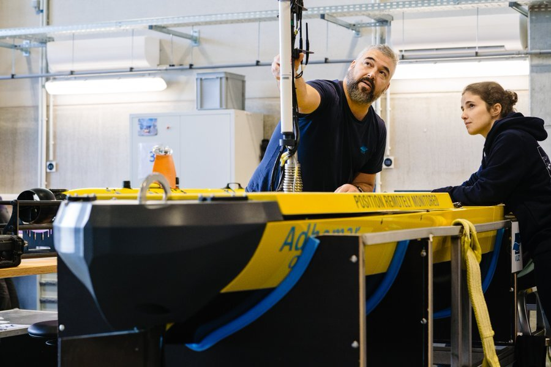




<!DOCTYPE html>
<html lang="en">
<head>
    <meta charset="UTF-8">
    <meta name="viewport" content="width=device-width, initial-scale=1.0">
    <title>Count Up Animation</title>
    
</head>
<body>

    

        <h1 id="counter">0</h1>
        Datasets Available
    

         
Join a thriving community of <strong>26,783 individuals</strong> and <strong>9,547 institutes</strong>, driving innovation across <strong>3,940 projects</strong>. At Flanders Marine Institute, we harness the power of data to foster collaboration and unlock new insights.

    

</body>
</html>

    

        <h4>Access to over 270,084 unique publications</h4>
        The VLIZ Marine Data Centre or VMDC is a national and international point of contact for quality and reliable marine and estuarine data. The VMDC provides services, technologies, tools, training and support to scientists, policy, blue economy and citizens. Data is made accessible in an efficient and open manner. The VMDC is accredited as an IODE National Oceanographic Data Center.
        

<a href="/search" class="button"><strong>Start exploring</strong></a>

<a href="/submit" class="button"><strong>Submit your data</strong></a>

        
        <h4>What does VMDC do?</h4>
        Lorem ipsum dolor sit amet, consectetur adipiscing elit sed do eiusmod tempor incididunt ut labore et dolore magna aliqua. Ut enim ad minim veniam, quis nostrud exercitation ullamco laboris nisi ut aliquip ex ea commodo consequat. Duis aute irure dolor in reprehenderit in voluptate velit esse cillum dolore eu fugiat nulla pariatur. Excepteur sint occaecat cupidatat non proident, sunt in culpa qui officia deserunt mollit anim id est laborum.
        
<a href="/about">Learn more about us</a>

    

    

        
        The <a href="https://www.vliz.be/nl/wat-we-doen/aanbod-infrastructuur/robotica">VLIZ Marine Robotics Centre</a> (MRC) pioneers in Marine Autonomous Systems (MAS) in order to enable comprehensive observations in remote, harsh, and vast environments within our world’s oceans and seas.
    



