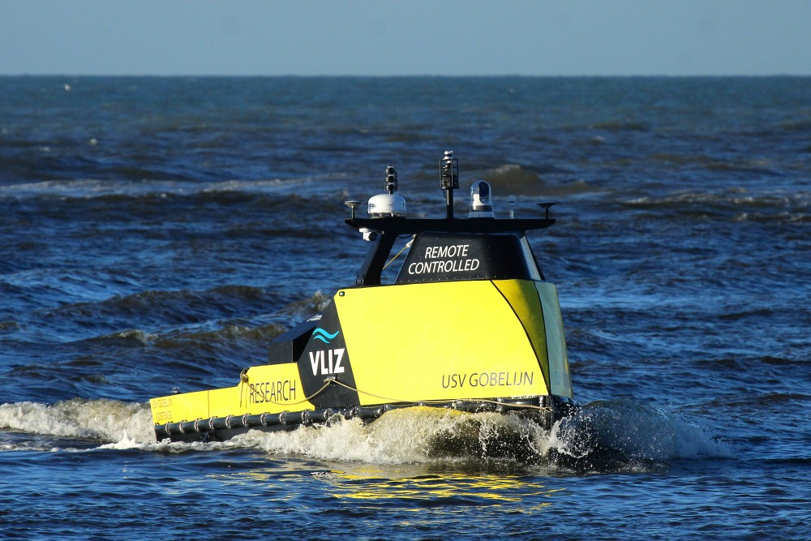

# Search VMDC Database

Lorem ipsum dolor sit amet, consectetur adipiscing elit sed do eiusmod tempor incididunt ut labore et dolore magna aliqua. Ut enim ad minim veniam, quis nostrud exercitation ullamco laboris nisi ut aliquip ex ea commodo consequat. Duis aute irure dolor in reprehenderit in voluptate velit esse cillum dolore eu fugiat nulla pariatur. Excepteur sint occaecat cupidatat non proident, sunt in culpa qui officia deserunt mollit anim id est laborum.

here you would put other stuff

<html lang="en">
<head>
    <meta charset="UTF-8">
    <meta name="viewport" content="width=device-width, initial-scale=1.0">
    <title>VMDC Database</title>
    
</head>
<body>

   

        <h4>VMDC Database</h4>
        
Lorem ipsum dolor sit amet, consectetur adipiscing elit sed do eiusmod tempor incididunt ut labore et dolore magna aliqua...

        
  <table>
            <tr>
               
  <td>Access to all the people held in our database</td>
                 <td><button onclick="location.href='https://www.example.com/page1'">People</button></td>
            </tr>
            <tr>
               
 <td>Access to all the institutes held in our database</td>
                 <td><button onclick="location.href='https://www.example.com/page2'">Institutes</button></td>
            </tr>
            <tr>

  <td>Access to all the projects held in our database</td>
                                <td><button onclick="location.href='https://www.example.com/page3'">Projects</button></td>
            </tr>
            <tr>

  <td>Access to all the datasets held in our database</td>
                                <td><button onclick="location.href='https://www.example.com/page4'">Dataset</button></td>
            </tr>
        </table>
    

  

        <h4>Hosted Datasystems</h4>
        
Lorem ipsum dolor sit amet, consectetur adipiscing elit sed do eiusmod tempor incididunt ut labore et dolore magna aliqua...

        
   <table>
            <tr>
                <td><button onclick="location.href='https://www.marinespecies.org/'">WoRMs</button></td>
                <td>World Register of Marine Species</td>
            </tr>
            <tr>
                <td><button onclick="location.href='https://emodnet.ec.europa.eu/en/biology'">EMODnet Biology</button></td>
                <td>Blah blah Blah....</td>
            </tr>
            <tr>
                <td><button onclick="location.href='https://marineregions.org/'">Marine Regions</button></td>
                <td>Blah blah Blah....</td>
            </tr>
            <tr>
                <td><button onclick="location.href='https://www.eurobis.org/'">EurOBIS</button></td>
                <td>Blah blah Blah....</td>
            </tr>
        </table>
    

  <h4>Cruise Database</h4>

  

        
        

            MIDAS stands for Marine Information and Data Acquisition System. This suite of programs is developed at Flanders Marine Institute (VLIZ) to plan the cruises of the RV Simon Stevin, to register the research activities during these cruises and to capture navigational, meteorological, and oceanographic parameters while underway.  
              
            Lorem ipsum dolor sit amet, consectetur adipiscing elit sed do eiusmod tempor incididunt ut labore et dolore magna aliqua...
        

    

 <table>
        <tr>
            <td><button onclick="location.href='https://www.vliz.be/vmdcdata/midas/casts'">CTD Casts</button></td>
            <td>CTD data</td>
        </tr>
        <tr>
            <td><button onclick="location.href='https://www.vliz.be/vmdcdata/midas/stations/map'">Stations</button></td>
            <td>Blah blah Blah....</td>
        </tr>
        <tr>
            <td><button onclick="location.href='https://www.vliz.be/vmdcdata/midas/cruises'">Cruises</button></td>
            <td>Blah blah Blah....</td>
        </tr>
        <tr>
            <td><button onclick="location.href='https://www.vliz.be/vmdcdata/midas/campaigns'">Campaigns</button></td>
            <td>List of campaigns</td>
        </tr>
    </table>

</body>
</html>

[**Do we want this?**](https://www.coretrustseal.org/why-certification/requirements/?)
