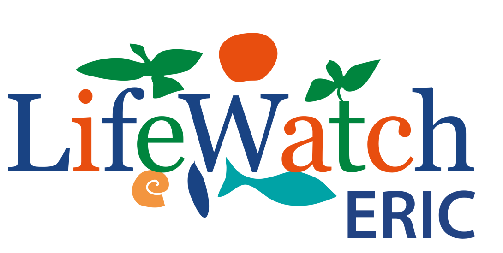
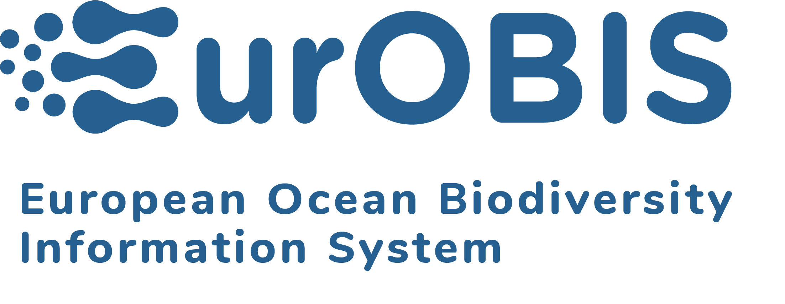

<h2 style="text-align: center;">Hosted Data Systems</h2>

  <h4>Most relevant</h4>
  

    <button>
        <a href="https://www.marinespecies.org/aphia.php?p=search" target="_blank">
            Search marine names on  WoRMS
        </a>
    </button>
    <button>
        <a href="https://emodnet.ec.europa.eu/geoviewer/" target="_blank">
            Search in-situ marine data on  EMODnet Biology
        </a>
    </button>
    <button>
        <a href="https://marineregions.org/gazetteer.php?p=search" target="_blank">
            Search marine features on  Marine Regions
        </a>
    </button>
    <button>
        <a href="https://www.eurobis.org/data_access_services" target="_blank">
            Search biogeographic data on  EurOBIS
        </a>
    </button>
    <button>
        <a href="https://www.lifewatch.be/data-services" target="_blank">
            Search data processing tools   LifeWatch Belgium
        </a>
    </button>
  

 
  <h4>Metadata Catalogue</h4>
  
Access to our new linked open (meta) data catalogue – discover, re-use, or search the vast network of marine data using MarineInfo.org via Integrated Marine Information System (IMIS). Here at the VLIZ we are applying linked-open-data principles and technologies as a basis for ensuring the FAIR values. 

  

    <button>
        <a href="https://marineinfo.org/search?size=n_20_n&filters%5B0%5D%5Bfield%5D=type&filters%5B0%5D%5Bvalues%5D%5B0%5D=person&filters%5B0%5D%5Btype%5D=aggregation&filters%5B0%5D%5Bpersistent%5D=false" target="_blank">People</a>
    </button>
    <button>
        <a href="https://marineinfo.org/search?size=n_20_n&filters%5B0%5D%5Bfield%5D=type&filters%5B0%5D%5Bvalues%5D%5B0%5D=institute&filters%5B0%5D%5Btype%5D=aggregation&filters%5B0%5D%5Bpersistent%5D=false">Institutes</a>
    </button>
    <button>
        <a href="https://marineinfo.org/search?size=n_20_n&filters%5B0%5D%5Bfield%5D=type&filters%5B0%5D%5Bvalues%5D%5B0%5D=project&filters%5B0%5D%5Btype%5D=aggregation&filters%5B0%5D%5Bpersistent%5D=false" target="_blank">Projects</a>
    </button>
    <button>
        <a href="https://marineinfo.org/search?size=n_20_n&filters%5B0%5D%5Bfield%5D=type&filters%5B0%5D%5Bvalues%5D%5B0%5D=dataset&filters%5B0%5D%5Btype%5D=aggregation&filters%5B0%5D%5Bpersistent%5D=false" target="_blank">Datasets</a>
    </button>
    <button>
        <a href="https://marineinfo.org/search?size=n_20_n&filters%5B0%5D%5Bfield%5D=type&filters%5B0%5D%5Bvalues%5D%5B0%5D=publication&filters%5B0%5D%5Btype%5D=aggregation&filters%5B0%5D%5Bpersistent%5D=false" target="_blank">Publications</a>
    </button>
    <button>
        <a href="https://marineinfo.org/search?size=n_20_n&filters%5B0%5D%5Bfield%5D=type&filters%5B0%5D%5Bvalues%5D%5B0%5D=event&filters%5B0%5D%5Btype%5D=aggregation&filters%5B0%5D%5Bpersistent%5D=false" target="_blank">Events</a>
    </button>

  

  

  <!-- Data Portals Section: Organized and visually enhanced -->
  <h2 style="text-align: center;">VLIZ Data Portals</h2>
  

<!-- Biodiversity -->
    

    <h3>Biodiversity</h3>
     
      <!-- Biodiversity Portals List -->
      

        <!-- ETN -->
        

          
          

            <h5>ETN</h5>
            

              The <strong>European Tracking Network (ETN)</strong> data portal provides access to aquatic animal tracking data, including acoustic telemetry and archival data. Explore movement patterns and research on aquatic species across Europe.
            

          

          <a href="https://www.lifewatch.be/etn/" target="_blank" title="ETN Homepage" style="display: inline-block; background: #31b7bc; border-radius: 50%; min-width: 48px; height: 48px; text-align: center; line-height: 48px; margin-left: 0.5rem;">
            <svg xmlns="http://www.w3.org/2000/svg" width="28" height="28" fill="white" viewBox="0 0 24 24" style="vertical-align: middle;">
              <path d="M3.9 12a5.1 5.1 0 0 1 5.1-5.1h3V5H9A7 7 0 0 0 9 19h3v-1.9h-3A5.1 5.1 0 0 1 3.9 12zm4.6 1h7v-2h-7v2zm6-8.1V5h1.9A5.1 5.1 0 0 1 21.1 12a5.1 5.1 0 0 1-5.1 5.1H15v1.9h1.9A7 7 0 0 0 15 5z"/>
            </svg>     
          </a>
        

        

          
          

            <h5>LifeWatch Belgium</h5>
            

              <strong>LifeWatch Belgium</strong> offers data services and tools for biodiversity research, including species observations, ecological datasets, and data processing platforms supporting marine and terrestrial studies.
            

          

          <a href="https://www.lifewatch.be/data-services" target="_blank" title="LifeWatch Belgium" style="display: inline-block; background: #31b7bc; border-radius: 50%; min-width: 48px; height: 48px; text-align: center; line-height: 48px; margin-left: 0.5rem;">
            <svg xmlns="http://www.w3.org/2000/svg" width="28" height="28" fill="white" viewBox="0 0 24 24" style="vertical-align: middle;">
              <path d="M3.9 12a5.1 5.1 0 0 1 5.1-5.1h3V5H9A7 7 0 0 0 9 19h3v-1.9h-3A5.1 5.1 0 0 1 3.9 12zm4.6 1h7v-2h-7v2zm6-8.1V5h1.9A5.1 5.1 0 0 1 21.1 12a5.1 5.1 0 0 1-5.1 5.1H15v1.9h1.9A7 7 0 0 0 15 5z"/>
            </svg>  
          </a>
        

        

          
          

            <h5>EurOBIS</h5>
            

              The <strong>European Ocean Biodiversity Information System (EurOBIS)</strong> is a data portal for biogeographic distribution of marine species, supporting research and policy with harmonized occurrence records.
            

          

          <a href="https://www.eurobis.org/data_access_services" target="_blank" title="EurOBIS Portal" style="display: inline-block; background: #31b7bc; border-radius: 50%; min-width: 48px; height: 48px; text-align: center; line-height: 48px; margin-left: 0.5rem;">
          <svg xmlns="http://www.w3.org/2000/svg" width="28" height="28" fill="white" viewBox="0 0 24 24" style="vertical-align: middle;">
              <path d="M3.9 12a5.1 5.1 0 0 1 5.1-5.1h3V5H9A7 7 0 0 0 9 19h3v-1.9h-3A5.1 5.1 0 0 1 3.9 12zm4.6 1h7v-2h-7v2zm6-8.1V5h1.9A5.1 5.1 0 0 1 21.1 12a5.1 5.1 0 0 1-5.1 5.1H15v1.9h1.9A7 7 0 0 0 15 5z"/>
            </svg>  
          </a>
        

        <!-- EMODnet Biology -->
        

          
          

            <h5>EMODnet Biology</h5>
            

              <strong>EMODnet Biology</strong> provides access to in-situ marine biological data, including species distribution, abundance, and habitat information for European waters.
            

          

          <a href="https://emodnet.ec.europa.eu/geoviewer/" target="_blank" title="EMODnet Biology" style="display: inline-block; background: #31b7bc; border-radius: 50%; min-width: 48px; height: 48px; text-align: center; line-height: 48px; margin-left: 0.5rem;"><svg xmlns="http://www.w3.org/2000/svg" width="28" height="28" fill="white" viewBox="0 0 24 24" style="vertical-align: middle;">
              <path d="M3.9 12a5.1 5.1 0 0 1 5.1-5.1h3V5H9A7 7 0 0 0 9 19h3v-1.9h-3A5.1 5.1 0 0 1 3.9 12zm4.6 1h7v-2h-7v2zm6-8.1V5h1.9A5.1 5.1 0 0 1 21.1 12a5.1 5.1 0 0 1-5.1 5.1H15v1.9h1.9A7 7 0 0 0 15 5z"/>
            </svg>  
          </a>
        

        

          
          

            <h5>ScheldeMonitor</h5>
            

              <strong>ScheldeMonitor</strong> is a Flemish-Dutch portal for research and monitoring in the Scheldt estuary, providing access to environmental data, reports, and knowledge resources.
            

          

          <a href="https://www.scheldemonitor.be/en" target="_blank" title="ScheldeMonitor" style="display: inline-block; background: #31b7bc; border-radius: 50%; min-width: 48px; height: 48px; text-align: center; line-height: 48px; margin-left: 0.5rem;"><svg xmlns="http://www.w3.org/2000/svg" width="28" height="28" fill="white" viewBox="0 0 24 24" style="vertical-align: middle;">
              <path d="M3.9 12a5.1 5.1 0 0 1 5.1-5.1h3V5H9A7 7 0 0 0 9 19h3v-1.9h-3A5.1 5.1 0 0 1 3.9 12zm4.6 1h7v-2h-7v2zm6-8.1V5h1.9A5.1 5.1 0 0 1 21.1 12a5.1 5.1 0 0 1-5.1 5.1H15v1.9h1.9A7 7 0 0 0 15 5z"/>
            </svg>  
          </a>
        

      

    

    

      <h3>Acoustic</h3>
       
      

        
        

          <h5>SoundLib</h5>
          

            <strong>SoundLib</strong> is an open-access, AI-powered underwater sound library for the North Sea. It supports research on marine soundscapes, biodiversity, and noise pollution by providing curated audio datasets and analysis tools.
          

        

        

          <a href="https://www.marinesoundlib.org/data/en/stations" target="_blank" title="Visit SoundLib" style="display: inline-block; background: #31b7bc; border-radius: 50%; min-width: 48px; height: 48px; text-align: center; line-height: 48px;">
            <svg xmlns="http://www.w3.org/2000/svg" width="28" height="28" fill="white" viewBox="0 0 24 24" style="vertical-align: middle;">
              <path d="M3.9 12a5.1 5.1 0 0 1 5.1-5.1h3V5H9A7 7 0 0 0 9 19h3v-1.9h-3A5.1 5.1 0 0 1 3.9 12zm4.6 1h7v-2h-7v2zm6-8.1V5h1.9A5.1 5.1 0 0 1 21.1 12a5.1 5.1 0 0 1-5.1 5.1H15v1.9h1.9A7 7 0 0 0 15 5z"/>
            </svg>  
          </a>
        

      

    

   <!-- Geographic -->
   

    <h3>Geographic</h3>
     
    <!-- Marine Regions -->
    

      
      

        <h5>Marine Regions</h5>
        

          <strong>Marine Regions</strong> provides standardized geographic information on marine features, boundaries, and place names, supporting mapping and spatial analysis for marine science and policy.
        

      

      

        <a href="https://marineregions.org/gazetteer.php?p=search" target="_blank" title="Marine Regions" style="display: inline-block; background: #31b7bc; border-radius: 50%; min-width: 48px; height: 48px; text-align: center; line-height: 48px;">
          <svg xmlns="http://www.w3.org/2000/svg" width="28" height="28" fill="white" viewBox="0 0 24 24" style="vertical-align: middle;">
              <path d="M3.9 12a5.1 5.1 0 0 1 5.1-5.1h3V5H9A7 7 0 0 0 9 19h3v-1.9h-3A5.1 5.1 0 0 1 3.9 12zm4.6 1h7v-2h-7v2zm6-8.1V5h1.9A5.1 5.1 0 0 1 21.1 12a5.1 5.1 0 0 1-5.1 5.1H15v1.9h1.9A7 7 0 0 0 15 5z"/>
            </svg>  
        </a>
      

    

    <!-- Bathymetry -->
    

      
      

        <h5>Bathymetry</h5>
        

          We have made available some high resolution VLIZ bathymetry datasets from the Belgian part to the North Sea (BPNS) to EMODnet Bathymetry. Additionally, an overview of some more measurements that were carried out in the Belgian part of the North Sea can be seen on Kustportaal and downloaded via MDA.
        

      

      

        <a href="https://www.kustportaal.be/geoviewer/index.php?lang=nl&layer_collections=KP_Bathymetrie+en+Bodemsamenstelling&active_layer_themes=Bathymetrie#!/" target="_blank" title="Kustportaal- BPNS" style="display: inline-block; background: #31b7bc; border-radius: 50%; min-width: 48px; height: 48px; text-align: center; line-height: 48px;">
          <svg xmlns="http://www.w3.org/2000/svg" width="28" height="28" fill="white" viewBox="0 0 24 24" style="vertical-align: middle;">
              <path d="M3.9 12a5.1 5.1 0 0 1 5.1-5.1h3V5H9A7 7 0 0 0 9 19h3v-1.9h-3A5.1 5.1 0 0 1 3.9 12zm4.6 1h7v-2h-7v2zm6-8.1V5h1.9A5.1 5.1 0 0 1 21.1 12a5.1 5.1 0 0 1-5.1 5.1H15v1.9h1.9A7 7 0 0 0 15 5z"/>
            </svg>  
        </a>
        <a href="https://cdi.seadatanet.org/search/welcome.php?query=3219&query_code={927CE7BC-D84E-4814-B408-132599C94896}" target="_blank" title="SeaDataNet" style="display: inline-block; background: #31b7bc; border-radius: 50%; width: 48px; height: 48px; text-align: center; line-height: 48px;">
          <svg xmlns="http://www.w3.org/2000/svg" width="28" height="28" fill="white" viewBox="0 0 24 24" style="vertical-align: middle;">
              <path d="M3.9 12a5.1 5.1 0 0 1 5.1-5.1h3V5H9A7 7 0 0 0 9 19h3v-1.9h-3A5.1 5.1 0 0 1 3.9 12zm4.6 1h7v-2h-7v2zm6-8.1V5h1.9A5.1 5.1 0 0 1 21.1 12a5.1 5.1 0 0 1-5.1 5.1H15v1.9h1.9A7 7 0 0 0 15 5z"/>
            </svg>  
        </a>
      

    

  

  <!-- Taxonomic -->
  

    <h3>Taxonomic</h3>
     
    

      
      

        <h5>WoRMS</h5>
        

          The <strong>World Register of Marine Species (WoRMS)</strong> is the authoritative database for marine species taxonomy, providing validated names, classification, and distribution information.
        

      

      

        <a href="https://www.marinespecies.org/aphia.php?p=search" target="_blank" title="WoRMS Search" style="display: inline-block; background: #31b7bc; border-radius: 50%; min-width: 48px; height: 48px; text-align: center; line-height: 48px;">
          <svg xmlns="http://www.w3.org/2000/svg" width="28" height="28" fill="white" viewBox="0 0 24 24" style="vertical-align: middle;">
              <path d="M3.9 12a5.1 5.1 0 0 1 5.1-5.1h3V5H9A7 7 0 0 0 9 19h3v-1.9h-3A5.1 5.1 0 0 1 3.9 12zm4.6 1h7v-2h-7v2zm6-8.1V5h1.9A5.1 5.1 0 0 1 21.1 12a5.1 5.1 0 0 1-5.1 5.1H15v1.9h1.9A7 7 0 0 0 15 5z"/>
            </svg>  
        </a>
      

    

  

<h2 style="text-align: center;">Published data products and datasets </h2>
 
  <h4>Cruise database</h4>
  

    
    

      <strong>MIDAS</strong> stands for <strong>Marine Information and Data Acquisition System</strong>.
      All data is organized in cruises and trips. Use the schedule, the chronological list of cruises, or cruises ordered by campaigns to select a specific cruise or trip. For each performed trip, a link to the underway data, the stations, research activities, and a map of the track is available.
    

    

      <button style="flex: 0 0 auto; width: auto; min-width: 100px; padding: 0.5rem 1rem;">
        <a href="https://www.vliz.be/vmdcdata/midas/campaigns" target="_blank" style="color: white;">Campaigns</a>
      </button>
      <button style="flex: 0 0 auto; width: auto; min-width: 100px; padding: 0.5rem 1rem;">
        <a href="https://www.vliz.be/vmdcdata/midas/cruises" target="_blank" style="color: white;">Cruises</a>
      </button>
      <button style="flex: 0 0 auto; width: auto; min-width: 100px; padding: 0.5rem 1rem;">
        <a href="https://www.vliz.be/vmdcdata/midas/stations/map" target="_blank" style="color: white;">Stations</a>
      </button>
      <button style="flex: 0 0 auto; width: auto; min-width: 100px; padding: 0.5rem 1rem;">
        <a href="https://www.vliz.be/vmdcdata/midas/casts" target="_blank" style="color: white;">CTD Casts</a>
      </button>
    

  

  <h4>Biodiversity dataset(s)</h4>
  

    <button style="flex: 0 0 auto; width: auto; min-width: 100px; padding: 0.5rem 1rem;">
      <a href="https://www.vliz.be/nl/imis?module=dataset&dasid=4687" target="_blank" style="color: white;">Zooplankton by ZooScan</a>
    </button>
    <button style="flex: 0 0 auto; width: auto; min-width: 100px; padding: 0.5rem 1rem;">
      <a href="https://www.vliz.be/nl/imis?module=dataset&dasid=4688" target="_blank" style="color: white;">Phytoplankton by FlowCam</a>
    </button>
    <button style="flex: 0 0 auto; width: auto; min-width: 100px; padding: 0.5rem 1rem;">
      <a href="https://www.vliz.be/nl/imis?module=dataset&dasid=6720" target="_blank" style="color: white;">Zooplankton by VPR</a>
    </button>
  

  

    
    

      VLIZ explores <strong>marine biodiversity</strong> through a range of research projects, focusing on organisms of all sizes and habitats. Our collections include comprehensive biodiversity datasets that support research on the health of marine ecosystems across Europe.
    

    

      

        <button style="flex: 0 0 auto; width: auto; min-width: 100px; padding: 0.5rem 1rem;">
          <a href="https://obis.org/dataset/781886f1-2d10-4752-9b04-24a22d6205ff" target="_blank" style="color: white;">Phytoplankton</a>
        </button>
        <button style="flex: 0 0 auto; width: auto; min-width: 100px; padding: 0.5rem 1rem;">
          <a href="https://obis.org/dataset/7a58ffd1-09d6-48a6-ba0b-07b8c4d474ca" target="_blank" style="color: white;">Macrobenthos</a>
        </button>
        <button style="flex: 0 0 auto; width: auto; min-width: 100px; padding: 0.5rem 1rem;">
          <a href="https://obis.org/dataset/877a23ca-4950-4237-a405-be49217cfc94" target="_blank" style="color: white;">Bentic Fauna</a>
        </button>
      

      

        <button style="flex: 0 0 auto; width: auto; min-width: 100px; padding: 0.5rem 1rem;">
          <a href="https://www.vliz.be/en/imis?dasid=5659&doiid=303" target="_blank" style="color: white;">Zooplankton</a>
        </button>
        <button style="flex: 0 0 auto; width: auto; min-width: 100px; padding: 0.5rem 1rem;">
          <a href="https://erddap.eurobis.org/erddap/info/north_sea_hypbent_com/index.html" target="_blank" style="color: white;">Hyperbenthic communities</a>
        </button>
        <button style="flex: 0 0 auto; width: auto; min-width: 100px; padding: 0.5rem 1rem;">
          <a href="https://www.vliz.be/en/imis?dasid=4598&amp;doiid=125" target="_blank" style="color: white;">Mesozooplankton</a>
        </button>
      

      

        <button style="flex: 0 0 auto; width: auto; min-width: 100px; padding: 0.5rem 1rem;">
          <a href="https://www.vliz.be/en/imis?dasid=4598&amp;doiid=125" target="_blank" style="color: white;">Belgian</a>
        </button>
        <button style="flex: 0 0 auto; width: auto; min-width: 100px; padding: 0.5rem 1rem;">
          <a href="https://marineinfo.org/imis?module=dataset&spcolid=1021&show=search" target="_blank" style="color: white;">Genetic</a>
        </button>
      

    

  

  <h4>Robotics</h4>
  

    

      
      Photo credit: Wieter Boone (VLIZ)
    

    

      VLIZ operates a fleet of advanced marine robots, including one autonomous underwater vehicle (AUV), two uncrewed surface vehicles (USVs), and two ocean gliders. These systems are well-suited for both fundamental and applied research, environmental monitoring, seabed mapping, water quality assessment, and the collection of biological and physical data in challenging marine environments.
       
       
      Check the data out on <a href="https://www.ncei.noaa.gov/erddap/index.html" target="_blank">ERDDAP</a> — it connects to remote servers for you, fetches and reformats the data, so you get what you need without hopping between sources.
    

    

      <button style="flex: 0 0 auto; width: auto; min-width: 100px; padding: 0.5rem 1rem;">
        <a href="https://erddap.vliz.be/erddap/search/index.html?page=1&itemsPerPage=1000&searchFor=VLIZ" target="_blank" style="color: white;">AUV Barabas</a>
      </button>
    

  

  <h4>Can't find what you're looking for?</h4>
  
Send us your data request today, and we’ll provide the high-quality information you need for your research or projects.

  <a href="mailto:data@vliz.be" class="cta-button">Send a data request</a>

